# 해줘잉(HawJowing)

여러 고민들을 다른사람들과 나누고 결정에 도움을 줄 수 있는 SNS 입니다.

- 개발 기간 : 22/01/3 ~ 22/02/18
- 팀명 : 워라벨


---

### 🌉개발배경

점심에 뭐먹을지, 여행은 어디로 갈지 등 여러 고민들을 가지고 있습니다. 이 고민들을 다른 사람들과 나누고 의견을 받거나 줄 수 있는 모바일웹 SNS를 개발하게 되었습니다.

---

### 팀원 및 역할

#### Front 

> 기술 스택
>
> > React, node.js

- 채성원

- 허영민

- 정정채

#### Back 

> 기술 스택
>
> > Spring boot, docker

- 정재현
- 한윤희
- 이은성

# Process


# 기획

## 프로젝트 기획

<ul>
  <li>E-R Diagram</li>
  <p align="center">
    
  </p>
  <li>Wireframe</li>
  <p align="center">
    
  </p>
  <li>Swagger API Document</li>
  <p align="center">
    
    
    
    
    
  </p>
</ul>

## 빌드 및 배포
<ul>
  <li>
    <b>사용한 JVM, 웹서버, WAS 제품  등의 종류와 설정값, 버전(IDE 버전 포함)</b>
    <ul>
      <li>JVM : Java 11</li>
      <li>통합개발환경(IDE) : 인텔리제이 3.1 (Back-end), VSCode 1.63.2 (Front-end)</li>
      <li>웹서버 : 로컬(http://localhost:8080, http://i6c103.p.ssafy.io)</li>
      <li>WAS : SpringBoot 내장 톰캣</li>
    </ul>
  </li>
  <li>
    <b>배포 아키텍쳐</b>
    <p align="center">
      
    </p>
  </li>
  <li>
    <b>포트 번호</b>
    <p>[Front-end] : 3000</p>
    <p>[Back-end] : 8080</p>
    <p>[Database] : 3306</p>
​    <b>Version</b>
    <ul>
      <li>[Front-end] : eact 17.0.2 , react-bootstrap 2.1.1, style-component 5.3.3 , web-vitals 2.1.3</li>
      <li>[Back-end] : 웹서버 : SpringBoot 2.5.9, Java : 11.0.13, jwt auth, Spring Security</li>
      <li>[Database] : mybatis 2.2.1 mysql 8.0.28</li>
      <li>[OS, Server] : Ubuntu 20.04, Nginx 1.18.0, AWS S3
    </ul>
  </li>
  <li>
    <p>Nginx</p>
    <p>nginx 설정(/etc/nginx/siteds-enabled/default</p>
    <p align="center">
      
    </p>
  </li>
  <li>
    <b>서버 세팅</b>
    <p align="center">
      
    </p>
  </li>
  <li>
    <b>Front-end</b>

    <p align="center">
      
    </p>

​    <b>Back-end</b>

    <p align="center">
      
    </p>


# Front-End

### React 기반 개발

- CSS module 과 Styled Component를 사용하여 각자 스타일대로 CSS 컴포넌트 구성

  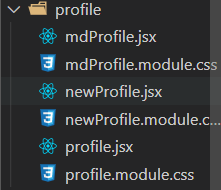

  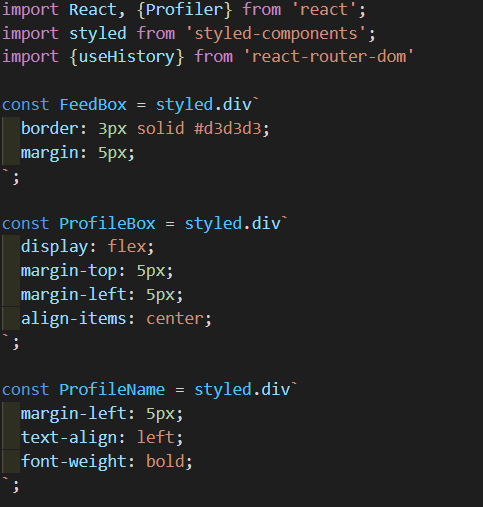

  

- React-redux 를 사용하여 Alarm 데이터를 저장 및 사용을하고 추후에 더 다양한 곳에 사용할 예정

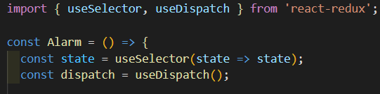

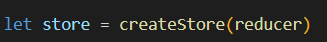


- Component 간에 Props 를 이용하여 Component 재사용성을 늘림

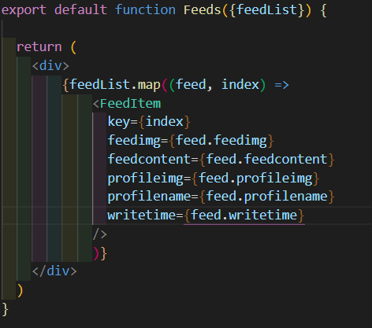

- React-router-dom 으로 페이지를 구성. 추후에 Next.js 를 학습하면 적용할 수도 있음

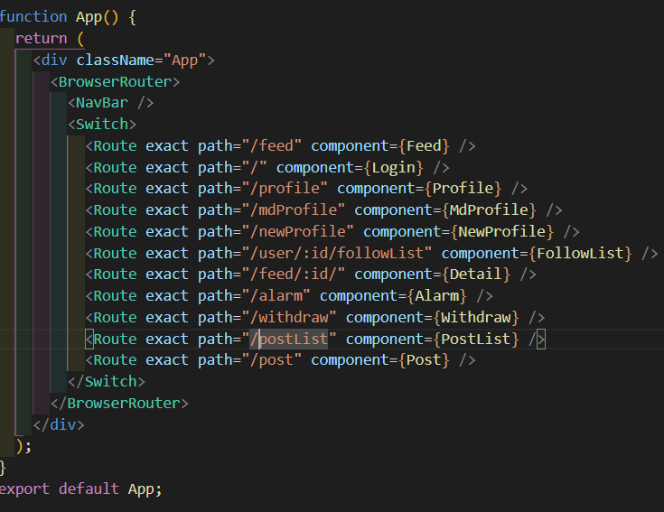

- React Hook 을 이용하여 CRUD, Infinite Scroll등 다양한 기능들을 구현

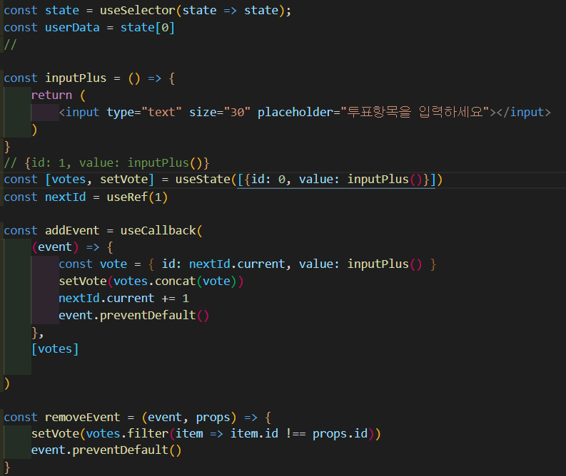

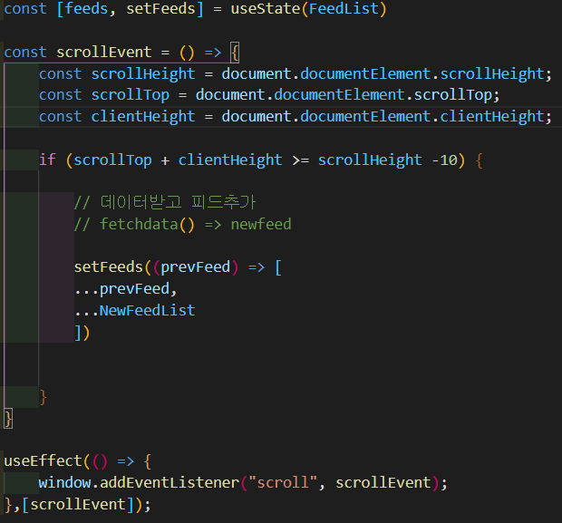

- 소셜로그인 라이브러리를 이용하여 OAuth를 통한 소셜로그인 구현

  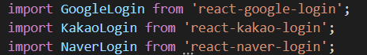

  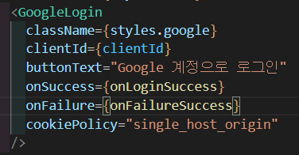

  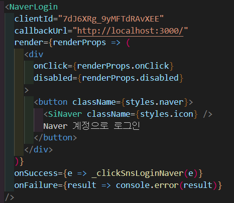

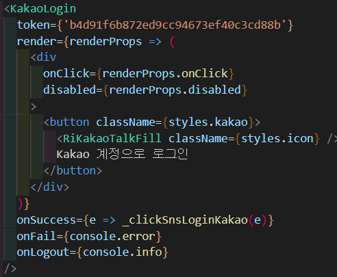


# Back-End

- Spring boot 기반 개발

## 프로젝트 구조

```tex
src
	-main/java/come.haejwoing.back
		-config
			-jwt
				-JwtAuthorizationFilter
				-JwtProperties
				-PrincipalDetails
				-PrincipalDetailsService
            -CorsConfig
            -SecurityConfig
        -controller
        	-*Controller
        -model
        	-dto
        	-mapper
        	-service
        BackApplication
    -resource
    	-mappers
    		-*.xml
    	-application.yml
	
```


## JWT

```java
public class JwtAuthorizationFilter extends BasicAuthenticationFilter {

	private UserService userService;

	public JwtAuthorizationFilter(AuthenticationManager authenticationManager, UserService userService) {
		super(authenticationManager);
		this.userService = userService;
	}

	@Override
	protected void doFilterInternal(HttpServletRequest request, HttpServletResponse response, FilterChain chain)
			throws IOException, ServletException {

		String header = request.getHeader(JwtProperties.HEADER_STRING);
		System.out.println("header Authorization : " + header);

		if (header == null || !header.startsWith(JwtProperties.TOKEN_PREFIX)) {
			chain.doFilter(request, response);
			return;
		}
		String token = request.getHeader(JwtProperties.HEADER_STRING).replace(JwtProperties.TOKEN_PREFIX, "");

		// 토큰 검증 (이게 인증이기 때문에 AuthenticationManager도 필요 없음)
		// 내가 SecurityContext에 집적접근해서 세션을 만들때 자동으로 UserDetailsService에 있는
		// loadByUsername이 호출됨.
		String nickname = JWT.require(Algorithm.HMAC512(JwtProperties.SECRET)).build().verify(token)
				.getClaim("nickname").asString();
		System.out.println("token : "+nickname);
```


## Controller

```java
@RestController
@RequestMapping("/jwt")
public class JwtController {

    @Autowired
    private UserServiceImpl userServiceImpl;

    @PostMapping("/google")
    public ResponseEntity<Map<String, Object>> isGoogleUser(@RequestBody Map<String, Object> data){
        GoogleUser googleUser = new GoogleUser((Map<String, Object>) data.get("profileObj"));
        log.info("data : {}", data);
        log.info("profileObj : {}", data.get("profileObj"));
        User userEntity = userServiceImpl.searchByEmail(googleUser.getEmail());

        if(userEntity == null) {
            log.info("구글 로그인 첫 방문");
            Map<String, Object> map = new HashMap<>();
            map.put("check", false);
            map.put("email", googleUser.getEmail());
            log.info(map.toString());
            return new ResponseEntity<>(map, HttpStatus.OK);

        } else if(userEntity.getUserStatus() == 0){ // 회원 탈퇴한 기록이 있는 위저가 들어오면 다시 회원가입해줘야함
            log.info("구글 탈퇴 했던 회원");
            Map<String, Object> map = new HashMap<>();
            map.put("check", false);
            map.put("email", googleUser.getEmail());
            log.info(map.toString());
            return new ResponseEntity<>(map, HttpStatus.OK);

        } else if(userEntity.getUserStatus() == 1) {
            log.info("구글 회원가입 완료 회원 ");
            User userRequest = User.builder()
                    .email(userEntity.getEmail())
                    .nickname(userEntity.getNickname())
                    .role("ROLE_USER")
                    .image(userEntity.getImage())
                    .userStatus(1)
                    .build();

            String jwtToken = new JwtProvider().createJwtToken(userRequest);
            Map<String, Object> map = new HashMap<>();
            map.put("check", true);
            map.put("id", userServiceImpl.getUserId(userEntity.getEmail()));
            map.put("jwtToken", jwtToken);
            log.info("id : {}", map.get("jwtToken"));

            return new ResponseEntity<>(map, HttpStatus.OK);
        }
        else return new ResponseEntity<>(HttpStatus.NO_CONTENT);
    }

```


## Model

### Dto

```java
@Data
@Builder
public class User {

    private int id;
    private String email;
    private String nickname;
    private int gender;
    private String birth;
    private String image;
    private String role;
    private int userStatus;
    private double point;

    public List<String> getRoleList(){
        if(this.role.length() > 0){
            return Arrays.asList(this.role.split(","));
        }
        return new ArrayList<>();
    }
}
```

### Mapper

```java
@Mapper
public interface UserMapper {

    void insertUser(User user);
    User searchByEmail(String email);
    List<User> listAllUser();
    void withdrawUser(int id);
    void setPoint(Map<String, Object> map);
    List<User> listFollower(int id);
    List<User> listFollow(int id);
    int getUserId(String email);
    User userInfo(int id);
    void updateProfile(User user);
    int checkNickname(String nickname);
    int addFollow(int id, int toUser);
    int checkFollow(int id, int loginedId);
    int unFollow(int toUser, int fromUser);
    List<User> findByNickname(String nickname);
    List<Map<String, Object>> getFollowerId(int id);
    double getPercentage(int id);
    User getUserByNickname(String nickname);
    void updateByEmail(Map<String, Object> userMap);
}
```

### Service

```java
public interface UserService {

    void insertUser(User user);
    List<User> listAllUser();
    User searchByEmail(String email);
    void withdrawUser(int id);
    void setPoint(Map<String, Object> map);
    List<User> listFollower(int id);
    List<User> listFollow(int id);
    int getUserId(String email);
    User searchById(int id);
    void updateProfile(User user);
    Boolean checkNickname(String nickname);
    Boolean addFollow(int id, int toUser);
    Boolean checkFollow(int id, int loginedId);
    Boolean unFollow(int toUser, int fromUser);
    List<User> findByNickname(String nickname);
    List<Map<String, Object>> getfollowerId(int id);
    double getPercentage(int id);
    User getUserByNickname(String nickname);
    void updateByEmail(Map<String, Object> userMap);
}
```


## Resources

```xml
<?xml version="1.0" encoding="UTF-8"?>
<!DOCTYPE mapper PUBLIC "-//mybatis.org//DTD Mapper 3.0//EN"
        "http://mybatis.org/dtd/mybatis-3-mapper.dtd">
<mapper namespace="com.haejwoing.back.model.mapper.UserMapper">

    <insert id="insertUser" parameterType="User">
        insert into user(nickname, email, gender, role, birth, user_status, point, image)
        values (#{nickname}, #{email}, #{gender}, #{role}, #{birth}, #{userStatus}, #{point}, #{image})
    </insert>

    <update id="setPoint" parameterType="map">
        update user
        set point= point + #{score}
        where id=#{userId}
    </update>

    <select id="searchByEmail" parameterType="String" resultType="User">
        select * from user
        where email = #{email}
    </select>

    <select id="listAllUser" resultType="map">
        select nickname, email, gender, birth, image, role
        from user
    </select>

    <update id="withdrawUser" parameterType="int">
        update user
        set user_status = 0
        where id=#{id}

    </update>
```


### Properties

- application.yml

```properties
server:
  port: 8080

spring:
  datasource:
    driver-class-name: com.mysql.cj.jdbc.Driver
    
mybatis:
  type-aliases-package: com.haejwoing.back.model.dto
  mapper-locations: classpath:mappers/*.xml
```

